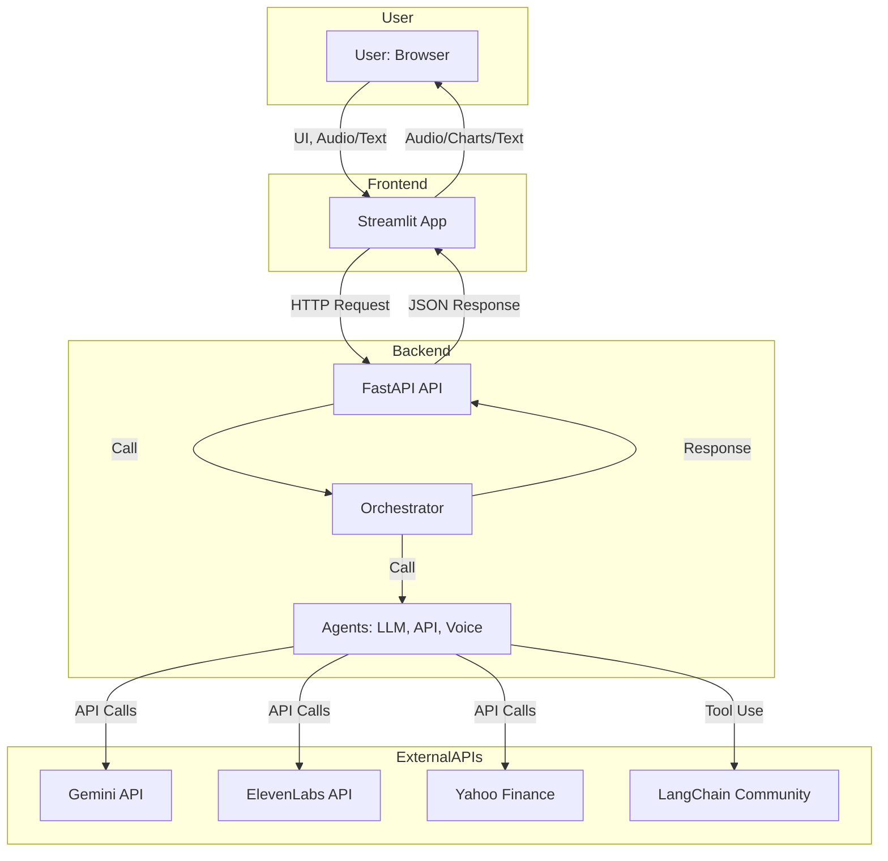
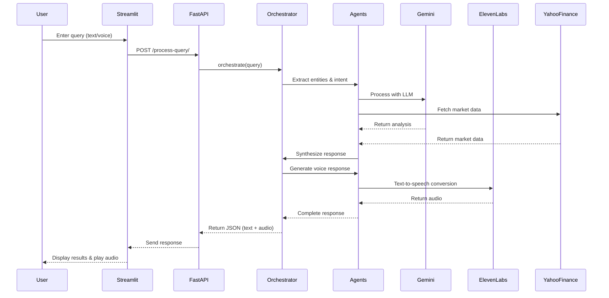
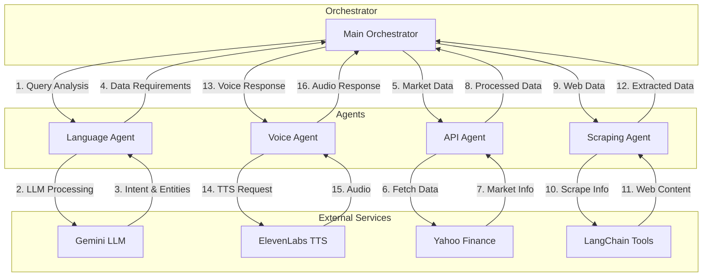
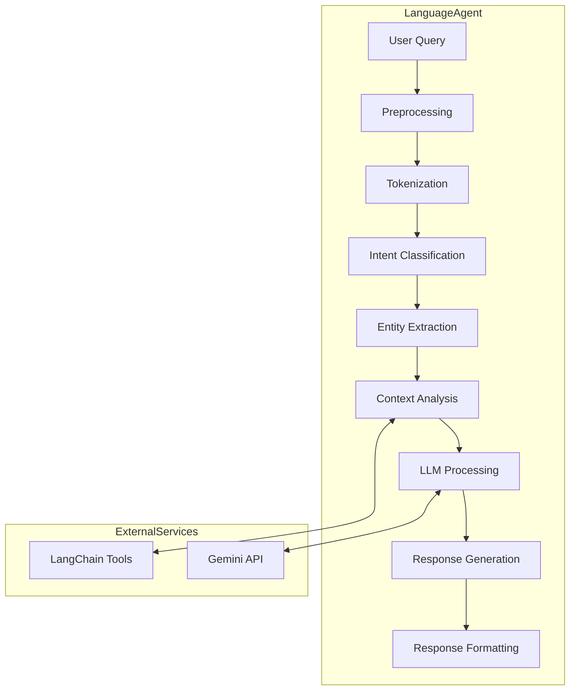
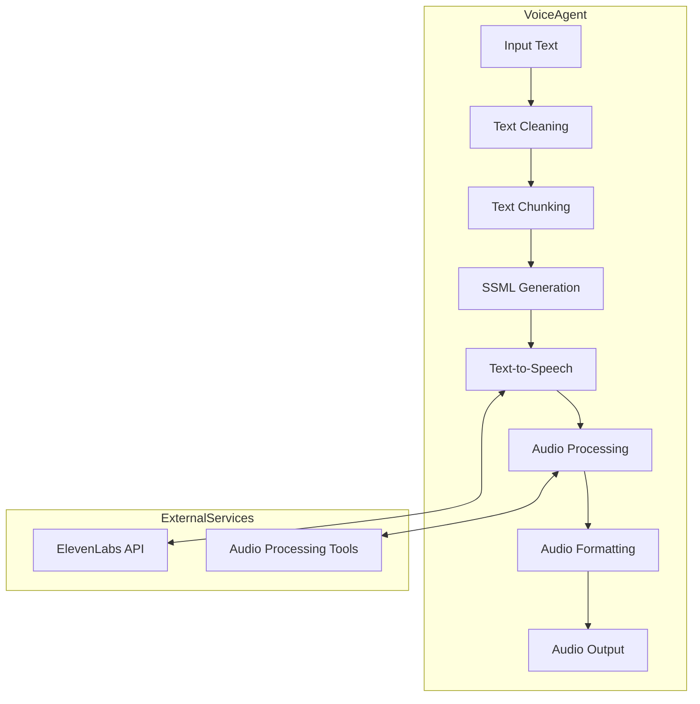
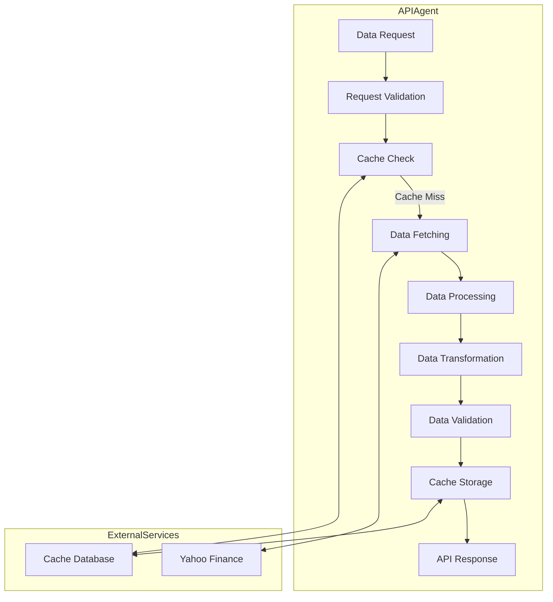
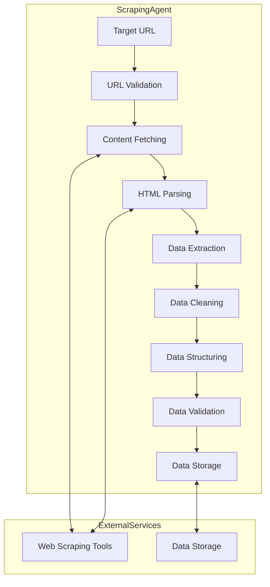

# Alpha Analyst: AI Financial Assistant

A full-stack, cloud-native AI financial analysis platform powered by FastAPI and Streamlit, designed to provide intelligent financial insights through natural language processing and voice interactions.

## 🌟 Features

- Natural language financial queries
- Voice-based interactions
- Real-time market data analysis
- AI-powered financial insights
- Interactive data visualization
- Text-to-speech responses

## 🏗️ System Architecture



## 🔄 Data Flow & Agent Interactions

### Sequence Diagram: End-to-End Flow



### Agent Interaction Flow



### Agent Responsibilities

1. **Language Agent (LA)**
   - Natural language understanding
   - Entity extraction
   - Intent classification
   - Query decomposition
   - Response synthesis

2. **Voice Agent (VA)**
   - Text-to-speech conversion
   - Voice response generation
   - Audio format handling
   - Voice customization

3. **API Agent (AA)**
   - Market data retrieval
   - Real-time price updates
   - Financial metrics calculation
   - Data validation

4. **Scraping Agent (SA)**
   - Web data extraction
   - News aggregation
   - Financial report parsing
   - Data cleaning

### Data Flow Explanation

1. **Query Processing**
   - User input (text/voice) → Streamlit
   - Streamlit → FastAPI endpoint
   - FastAPI → Orchestrator

2. **Agent Orchestration**
   - Orchestrator analyzes query
   - Routes to appropriate agents
   - Coordinates parallel processing
   - Aggregates responses

3. **Response Generation**
   - Agents process in parallel
   - Data synthesis by Orchestrator
   - Voice response generation
   - Final response assembly

4. **Response Delivery**
   - Orchestrator → FastAPI
   - FastAPI → Streamlit
   - Streamlit → User (text + audio)

### Individual Agent Flows

#### Language Agent Processing Flow



#### Voice Agent Processing Flow



#### API Agent Processing Flow



#### Scraping Agent Processing Flow



### Agent Processing Details

1. **Language Agent Processing**
   - **Preprocessing**: Text normalization, special character handling
   - **Tokenization**: Breaking text into meaningful units
   - **Intent Classification**: Determining user's goal
   - **Entity Extraction**: Identifying key financial terms
   - **Context Analysis**: Understanding query context
   - **LLM Processing**: Generating intelligent responses
   - **Response Generation**: Creating coherent answers
   - **Formatting**: Structuring response for presentation

2. **Voice Agent Processing**
   - **Text Cleaning**: Removing unnecessary elements
   - **Chunking**: Breaking text into manageable pieces
   - **SSML Generation**: Adding speech markup
   - **TTS Conversion**: Converting text to speech
   - **Audio Processing**: Enhancing audio quality
   - **Formatting**: Preparing audio for delivery

3. **API Agent Processing**
   - **Request Validation**: Ensuring valid data requests
   - **Cache Management**: Optimizing data retrieval
   - **Data Fetching**: Retrieving market data
   - **Processing**: Transforming raw data
   - **Validation**: Ensuring data accuracy
   - **Storage**: Caching for future use

4. **Scraping Agent Processing**
   - **URL Validation**: Ensuring valid sources
   - **Content Fetching**: Retrieving web content
   - **Parsing**: Extracting structured data
   - **Cleaning**: Removing irrelevant information
   - **Structuring**: Organizing data
   - **Validation**: Ensuring data quality
   - **Storage**: Saving processed data

## 📁 Project Structure

```
finance-assistant/
│
├── agents/
│   ├── api_agent.py
│   ├── scraping_agent.py
│   ├── llm_orchestrator.py
│   ├── language_agent.py
│   └── voice_agent.py
│
├── orchestrator/
│   ├── rag_orchestrator.py
│   └── main.py
│
├── streamlit_app/
│   ├── app.py
│   ├── utils.py
│   └── audio_utils.py
│
├── data_ingestion/
│   └── [data processing scripts]
│
├── docs/
│   └── [documentation files]
│
├── requirements.txt
├── Dockerfile
└── README.md
```

## 🚀 Quickstart

1. **Clone the Repository**
   ```bash
   git clone https://github.com/srikrishnavamsi/Finance-assistant.git
   cd finance-assistant
   ```

2. **Set Up Virtual Environment**
   ```bash
   python -m venv .venv
   source .venv/bin/activate  # On Windows: .venv\Scripts\activate
   ```

3. **Install Dependencies**
   ```bash
   pip install -r requirements.txt
   ```

4. **Run FastAPI Backend**
   ```bash
   cd orchestrator
   uvicorn main:app --reload
   ```
   Access Swagger UI at http://localhost:8000/docs

5. **Run Streamlit Frontend**
   ```bash
   cd ../streamlit_app
   streamlit run app.py
   ```

## 🛠️ Tech Stack

- **Frontend**: Streamlit
- **Backend**: FastAPI (Uvicorn)
- **LLM**: Gemini (Google Generative AI) via google-generativeai and LangChain
- **Voice**: ElevenLabs API
- **Data**: Yahoo Finance (yfinance)
- **Orchestration**: Modular agent pattern, LangChain
- **Deployment**: Render (FastAPI), Streamlit Cloud (Streamlit)

## 🔑 Required API Keys

- **Gemini API Key**: Get from [Google AI Studio](https://makersuite.google.com/app/apikey)
- **ElevenLabs API Key**: Get from [ElevenLabs](https://elevenlabs.io)
- **Voice ID**: Use default or your own from ElevenLabs

## 📚 Documentation

- [FastAPI Documentation](https://fastapi.tiangolo.com/)
- [Streamlit Documentation](https://docs.streamlit.io/)
- [LangChain Documentation](https://python.langchain.com/docs/get_started/introduction)
- [Google Generative AI](https://ai.google.dev/docs)
- [ElevenLabs API](https://docs.elevenlabs.io/)

## 🤝 Contributing

Contributions are welcome! Please feel free to submit a Pull Request.

## 📝 License

This project is licensed under the MIT License - see the LICENSE file for details.

## 🙏 Acknowledgements

- Inspired by PyBites FastAPI & Streamlit
- Render, Streamlit Community Cloud, and the open source community 
